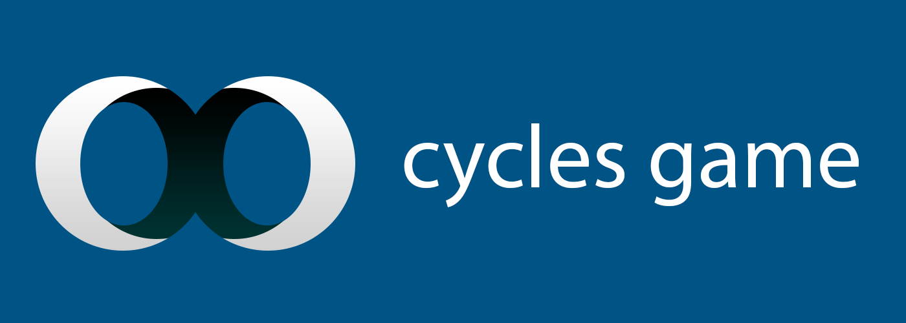

# Hello
I am a freelance developer located in Slovakia, most passionate about realtime 3D graphics rendering and innovative game development technology. I have grown to be an open source fan and believe in sharing with others. I am a huge advocate of Haxe and Kha, which I use to push my work forward.

Feel free to drop me an e-mail(lubos.lenco at me dot com), catch me on [Twitter](http://twitter.com/luboslenco) or add me on Skype(lubos.lenco). I am open to any sort of collaboration and love to hear what are you up to!

# Cycles Game

A complete game engine integrated into Blender, combining 3D development and content creation into one package.

[Read More](http://cyclesgame.org/)

# Lue

Lue is a 3D engine core, handling rendering, animation and content pipelines.

[Read More](http://lue3d.org/)

# LowPoly Factory

Low Poly Factory is a procedural content generation tool in a form of Blender add-on, specialized in lowpoly landscapes.

[Read More](http://lowpolyfactory.com/)

# Kha 3D Tutorials

A set of examples showing how to use 3D graphics api provided by Kha.

[Read More](http://luboslenco.com/kha3d/)

# Castle Siege

A card-based fantasy game.

[Read More](http://luboslenco.com/castlesiege/)

# Spiral Ride

A reaction-based action game.

[Read More](http://luboslenco.com/spiralride/)
